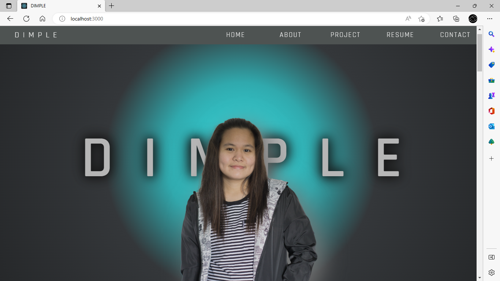
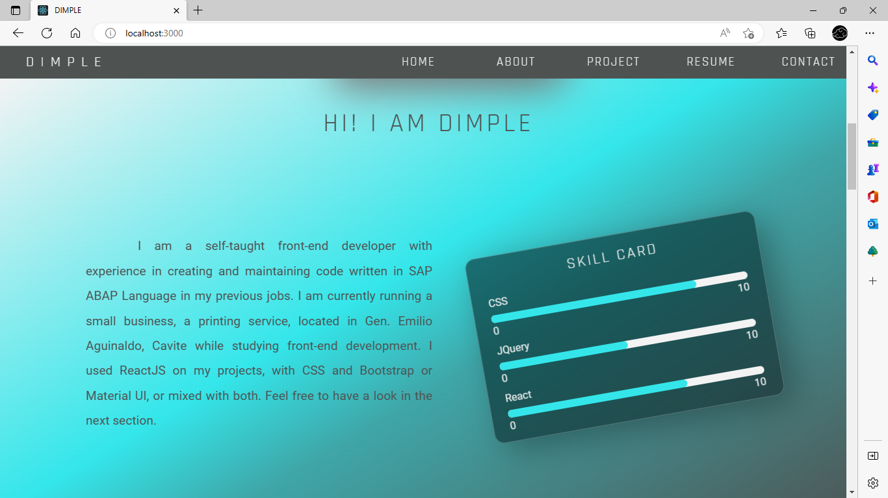
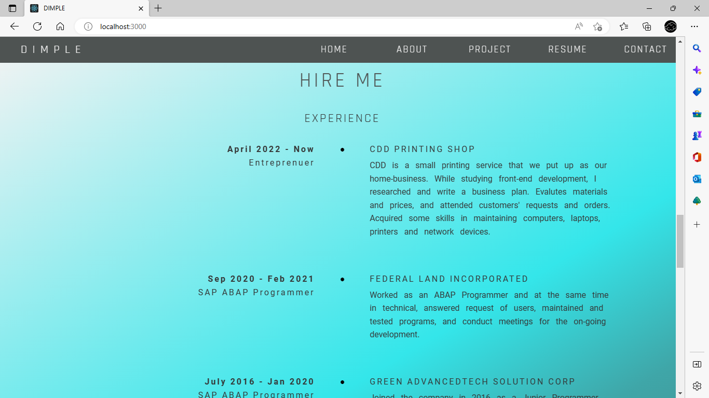

# Frontend Mentor - Interactive comments section solution

This is a solution to the Portfolio Project. Created this for career development, to 
be able to showcase what I have learn in Front-End Development Course for this past few months.

## Table of contents

- [Overview](#overview)
  - [Screenshot](#screenshot)
  - [Links](#links)
- [My process](#my-process)
  - [Built with](#built-with)
  - [Continued development](#continued-development)
  - [Useful resources](#useful-resources)
- [Author](#author)

**Note: Delete this note and update the table of contents based on what sections you keep.**

## Overview

### Screenshot

### Links

- Solution URL: https://github.com/Claudde/dimple/
- Live Site URL: https://claudde.github.io/dimple/

## My process

### Built with

- Semantic HTML5 markup
- CSS custom properties
- Flexbox
- CSS Grid
- [React](https://reactjs.org/) - JS library
- Framer Motion - for animation
- Font Awesome - Icons
- GitHub Pages - Deployment

### Continued development

1. Adding some animation in the future might add a few twist.
2. Improve mobile version and responsiveness

### Useful resources

- [CSS Glowing Card Hover Effects](https://www.youtube.com/watch?v=dSqZbwSRyhc) - This helped me in my Project section. I got some inspiration here.
- [Contact Buffalo](https://builtbybuffalo.com/contact) - Contacts section was inspired here.
- [Thomas Bosc](https://thomasbosc.com/en.html) - Layout and flow was referred to this website.
- [How to Create Responsive Navigation Bar using HTML and CSS](https://www.youtube.com/watch?v=oLgtucwjVII) - Reference of Navigation section.
- [Dribble Pinterest](https://www.pinterest.ph/pin/314266880241319916/) - This helped me with my hero section and my theme color. 

## Author

- Frontend Mentor - [@Claudde](https://www.frontendmentor.io/profile/Claudde)
- GitHub - [@Claudde](https://github.com/Claudde)
- LinkedIn - [Dhanabelle Cruzado](https://www.linkedin.com/in/dhanabelle-cruzado/)
